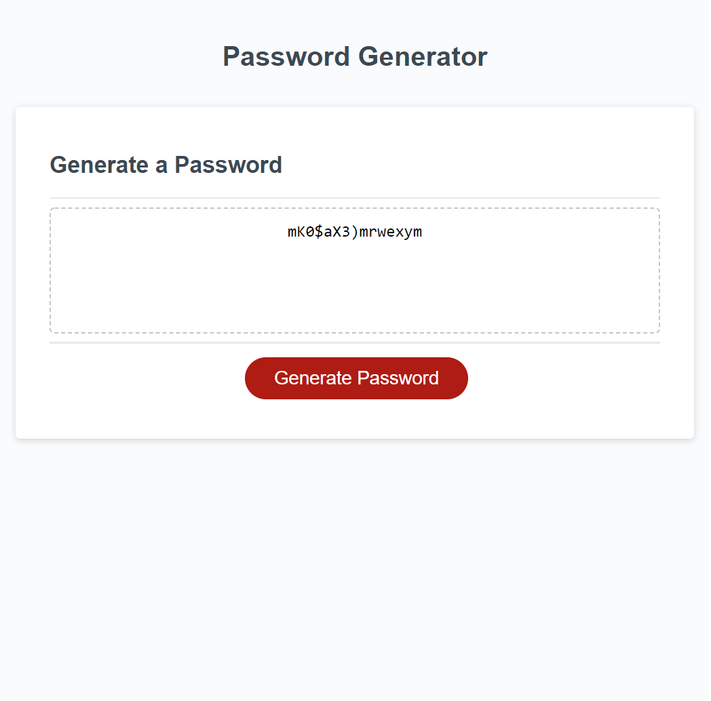

# Prompt-Based Password Generator

## Project Description

This project showcases a prompt-based password generator that can be customized to include or not include multiple character types such as lowercase, uppercase, special characters and numeric values.

* **Motivation** This application was designed to be prompt-based as upposed to interface-based to allow users to type their responses in order to generate a password.  

* **Solutions** This password generator was designed to allow users to generate a password with a variety of cusomizable criteria.  

* **Application** This project provided the opportunity to experience creating a web application where various elements inside of the HTML and CSS are modified from the Javascript. Additionally, this assignment introduced me to various math functions including math.random and math.floor. It also presented the opportunity to apply what was taught about traversing through the DOM and creating a for loop and using it to generate a value.

## Preview

## URL
Website: https://j-art-fox.github.io/Password-Generator-/